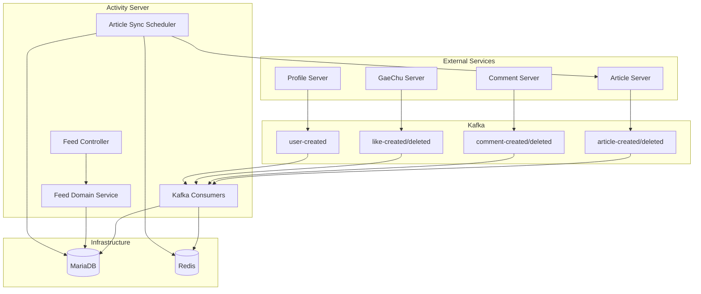
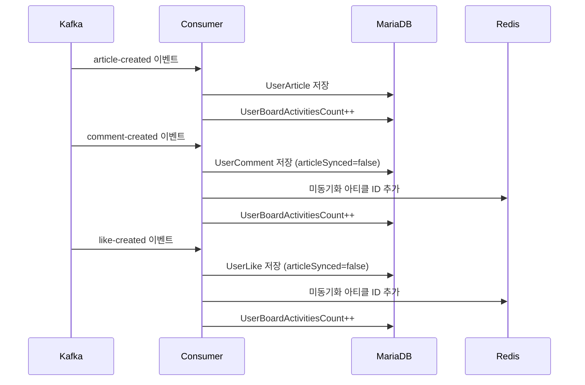
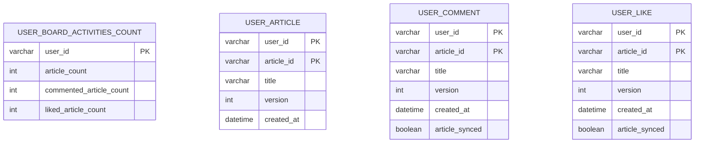
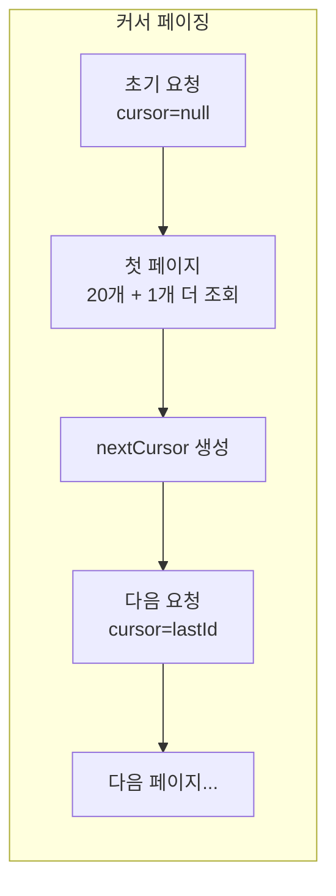
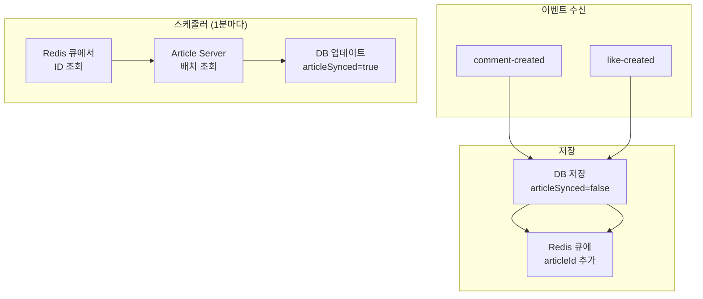

# Activity Server

## 1. 개요

Activity Server는 **사용자 활동 피드**를 제공하는 마이크로서비스입니다. Kafka 이벤트 기반으로 게시글, 댓글, 좋아요 활동을 수집하고, 커서 기반 페이징으로 사용자별 활동 타임라인을 제공합니다.

### 주요 기능

| 기능      | 설명                                |
|---------|-----------------------------------|
| 활동 수집   | Kafka Consumer로 게시글/댓글/좋아요 이벤트 수집 |
| 피드 조회   | 사용자별 활동 타임라인 제공                   |
| 커서 페이징  | 무한 스크롤 지원 (O(1) 성능)               |
| 활동 통계   | 카테고리별 활동 수 집계                     |
| 아티클 동기화 | 미동기화 아티클 정보 배치 처리                 |

### 기술 스택

| 구분          | 기술                         |
|-------------|----------------------------|
| Framework   | Spring Boot 3.5.6          |
| Language    | Java 21                    |
| Build Tool  | Gradle                     |
| Database    | MariaDB                    |
| Cache/Queue | Redis                      |
| Messaging   | Apache Kafka               |
| HTTP Client | Spring WebFlux (WebClient) |
| Scheduler   | ShedLock 5.10.0            |

---

## 2. 시스템 아키텍처

### 2.1 전체 구조



### 2.2 이벤트 처리 흐름



---

## 3. Kafka 이벤트 명세

### 3.1 Consumer 토픽

| 토픽                | Consumer             | 설명     |
|-------------------|----------------------|--------|
| `article-created` | ArticleEventConsumer | 게시글 생성 |
| `article-deleted` | ArticleEventConsumer | 게시글 삭제 |
| `comment-created` | CommentEventConsumer | 댓글 생성  |
| `comment-deleted` | CommentEventConsumer | 댓글 삭제  |
| `like-created`    | LikeEventConsumer    | 좋아요 생성 |
| `like-deleted`    | LikeEventConsumer    | 좋아요 삭제 |
| `user-created`    | ProfileEventConsumer | 사용자 생성 |

### 3.2 이벤트 스키마

#### ArticleCreatedEvent

```json
{
  "articleId": "art-123",
  "writerId": "user-456",
  "version": 1,
  "title": "게시글 제목",
  "createdAt": "2025-01-01T10:00:00"
}
```

#### CommentCreatedEvent

```json
{
  "writerId": "user-789",
  "articleId": "art-123",
  "createdAt": "2025-01-01T10:05:00"
}
```

#### LikeCreatedEvent

```json
{
  "likerId": "user-789",
  "articleId": "art-123",
  "createdAt": "2025-01-01T10:10:00"
}
```

#### ProfileCreateRequest

```json
{
  "userId": "user-999",
  "provider": "google"
}
```

### 3.3 Kafka 설정

```yaml
spring.kafka:
  bootstrap-servers: ${KAFKA_URL1},${KAFKA_URL2},${KAFKA_URL3}
  consumer:
    group-id: activity-consumer-group
    auto-offset-reset: earliest
  listener:
    ack-mode: record
  producer:
    retries: 3
```

---

## 4. 데이터 모델

### 4.1 ERD



### 4.2 인덱스

| 테이블          | 인덱스명                    | 컬럼                         | 용도      |
|--------------|-------------------------|----------------------------|---------|
| user_comment | idx_comment_sync_status | article_synced, created_at | 미동기화 조회 |
| user_like    | idx_like_sync_status    | article_synced, created_at | 미동기화 조회 |

---

## 5. API 명세

### 5.1 활동 통계 조회

```http
POST /api/board/feed
Content-Type: application/json

{
  "viewerId": "user-123",
  "targetUserId": "user-456",
  "categories": ["article", "comment", "like"]
}

Response: 200 OK
{
  "totals": {
    "article": 15,
    "comment": 42,
    "like": 189
  },
  "isOwner": false
}
```

| 필드           | 타입     | 필수 | 설명                |
|--------------|--------|----|-------------------|
| viewerId     | String | N  | 조회자 ID (권한 검사)    |
| targetUserId | String | Y  | 대상 사용자 ID         |
| categories   | List   | N  | 조회할 카테고리 (기본: 전체) |

### 5.2 카테고리별 피드 조회

```http
GET /api/board/feed/{category}?viewerId=...&targetUserId=...&cursor=...&size=20&sort=newest

Path Parameter:
- category: article | comment | like

Query Parameters:
- viewerId: 조회자 ID
- targetUserId: 대상 사용자 ID (필수)
- cursor: 페이징 커서
- size: 페이지 크기 (기본 20)
- sort: newest | oldest (기본 newest)

Response: 200 OK
{
  "articleIds": ["art-123", "art-122", "art-121"],
  "nextCursor": "art-120"
}
```

### 5.3 권한 검증

```java
// like 카테고리: 본인만 조회 가능
if ("like".equals(category) && !viewerId.equals(targetUserId)) {
    return 403 Forbidden;
}
```

---

## 6. 피드 생성 로직

### 6.1 커서 기반 페이징



```sql
-- newest: 최신순 조회
SELECT article_id, created_at
FROM user_article
WHERE user_id = ?
  AND (created_at < ? OR (created_at = ? AND article_id < ?))
ORDER BY created_at DESC, article_id DESC
LIMIT 21;
```

### 6.2 집계 테이블 활용

```java
// 집계 테이블 우선 조회 (빠름)
Optional<UserBoardActivitiesCount> agg = repository.findById(userId);
if (agg.isPresent()) {
    return agg.get().getArticleCount();
}
// 폴백: COUNT 쿼리 (느림)
return userArticleRepository.countByUserId(userId);
```

---

## 7. 아티클 동기화

### 7.1 동기화 프로세스



### 7.2 ShedLock 분산 스케줄러

```java
@Scheduled(fixedRate = 60000)  // 1분마다
@SchedulerLock(
    name = "syncMissingArticles",
    lockAtMostFor = "50s",
    lockAtLeastFor = "10s"
)
public void syncMissingArticles() {
    // 다중 인스턴스 환경에서 단 하나만 실행
    Set<String> articleIds = articleSyncQueue.popAll();
    if (articleIds.isEmpty() && emptyCheckCounter++ >= 60) {
        articleIds = findUnsyncedFromDB();  // 60분마다 DB 조회
    }
    // 100개씩 배치 처리
    for (partition(articleIds, 100)) {
        List<ArticleDto> articles = articleClient.getArticlesByIds(batch);
        updateArticleData(articles);
    }
}
```

### 7.3 Redis 큐 (ArticleSyncQueue)

```java
@Component
public class ArticleSyncQueue {
    private static final String QUEUE_KEY = "sync:missing-articles";

    public void addMissingArticle(String articleId) {
        redisTemplate.opsForSet().add(QUEUE_KEY, articleId);
    }

    public Set<String> popAll() {
        Set<String> ids = redisTemplate.opsForSet().members(QUEUE_KEY);
        redisTemplate.delete(QUEUE_KEY);
        return ids;
    }
}
```

---

## 8. 에러 코드

| HTTP | 의미          | 케이스             |
|------|-------------|-----------------|
| 200  | 성공          | 정상 응답           |
| 400  | Bad Request | targetUserId 누락 |
| 403  | Forbidden   | like 카테고리 권한 없음 |

---

## 9. 패키지 구조

```
com.teambind.activityserver/
├── config/
│   ├── WebClientConfig.java       # WebClient 설정
│   └── SchedulerConfig.java       # ShedLock 설정
├── domain/
│   ├── article/
│   │   ├── client/ArticleClient   # Article Server 호출
│   │   ├── scheduler/ArticleSyncScheduler
│   │   └── service/ArticleSyncQueue
│   └── board/
│       ├── controller/FeedController
│       ├── service/FeedDomainService
│       ├── repository/
│       │   ├── UserArticleRepository
│       │   ├── UserCommentRepository
│       │   ├── UserLikeRepository
│       │   └── UserBoardActivitiesCountRepository
│       ├── entity/
│       │   ├── UserArticle
│       │   ├── UserComment
│       │   ├── UserLike
│       │   └── UserBoardActivitiesCount
│       └── dto/
│           ├── FeedRequest
│           ├── FeedResponse
│           └── CategoryPage
├── messaging/
│   ├── consumer/
│   │   ├── ArticleEventConsumer
│   │   ├── CommentEventConsumer
│   │   ├── LikeEventConsumer
│   │   └── ProfileEventConsumer
│   ├── event/
│   │   ├── ArticleCreatedEvent
│   │   ├── CommentCreatedEvent
│   │   └── LikeCreatedEvent
│   └── common/LoggingAspect
└── common/exceptions/
```

---

## 10. 환경 설정

### 환경변수

| 변수                 | 설명                 |
|--------------------|--------------------|
| DATABASE_HOST      | MariaDB 호스트        |
| DATABASE_PORT      | MariaDB 포트         |
| DATABASE_NAME      | 데이터베이스명            |
| REDIS_HOST         | Redis 호스트          |
| REDIS_PORT         | Redis 포트           |
| KAFKA_URL1~3       | Kafka 브로커          |
| article_bucket_url | Article Server URL |

### application.yaml

```yaml
spring:
  profiles:
    active: dev
  jpa:
    hibernate:
      ddl-auto: none
    show-sql: true

shedlock:
  enabled: true
```

---

## 11. 성능 최적화

### 커서 페이징 vs 오프셋 페이징

```
오프셋 페이징: O(N) - OFFSET 값만큼 스캔
커서 페이징:   O(1) - 인덱스 시작점에서 바로 조회
```

### 집계 테이블 활용

```
COUNT(*) 쿼리: O(N) - 전체 스캔
집계 테이블:    O(1) - 단일 레코드 조회
```

### 배치 처리

```java
// N+1 문제 방지: 100개씩 배치 조회
GET /api/v1/bulk/articles?ids=1&ids=2&...&ids=100
```

### 중복 제거

```java
// LinkedHashMap으로 순서 유지 + 중복 제거
LinkedHashMap<String, ArticleCursorDto> dedup = new LinkedHashMap<>();
for (dto : sorted) {
    dedup.putIfAbsent(dto.articleId(), dto);
}
```

---

## 12. 배포

### Docker

```dockerfile
FROM eclipse-temurin:21-jdk AS build
WORKDIR /app
COPY . .
RUN ./gradlew clean bootJar

FROM eclipse-temurin:21-jre
COPY --from=build /app/build/libs/*.jar app.jar
ENTRYPOINT ["java", "-jar", "app.jar"]
```

### Docker Compose (다중 인스턴스)

```yaml
services:
  nginx:
    image: nginx:alpine
    ports: ["9299:80"]

  activity-server-1:
    image: activity-server:latest
    healthcheck:
      test: ["CMD", "curl", "-f", "http://localhost:8080/health"]
      interval: 15s

  activity-server-2:
    image: activity-server:latest

  activity-server-3:
    image: activity-server:latest
```

---

## 13. 코드 통계

| 항목           | 값   |
|--------------|-----|
| Java 파일 수    | 34개 |
| REST API     | 2개  |
| Kafka 토픽     | 7개  |
| 데이터베이스 테이블   | 4개  |
| Consumer 클래스 | 4개  |
